# Licipe|리시피

팀명: 앱 만들다 살찜

서비스명: Licipe

개발기간: 2021.07 ~ 2021.08(6주)

사용 스택: React, Redux, Material UI, HTML, CSS, JavaScript, AWS S3

개요: 음성인식 기술을 활용한 레시피 서비스. 레시피를 선택한 이후 영상 재생이나 레시피 단계 이동 등을 음성인식을 통해 제어 할 수 있습니다.

발표 자료: https://sinawi.tistory.com/364

Donggun's 프로젝트회고: https://sinawi.tistory.com/362 

## 1. 메인화면

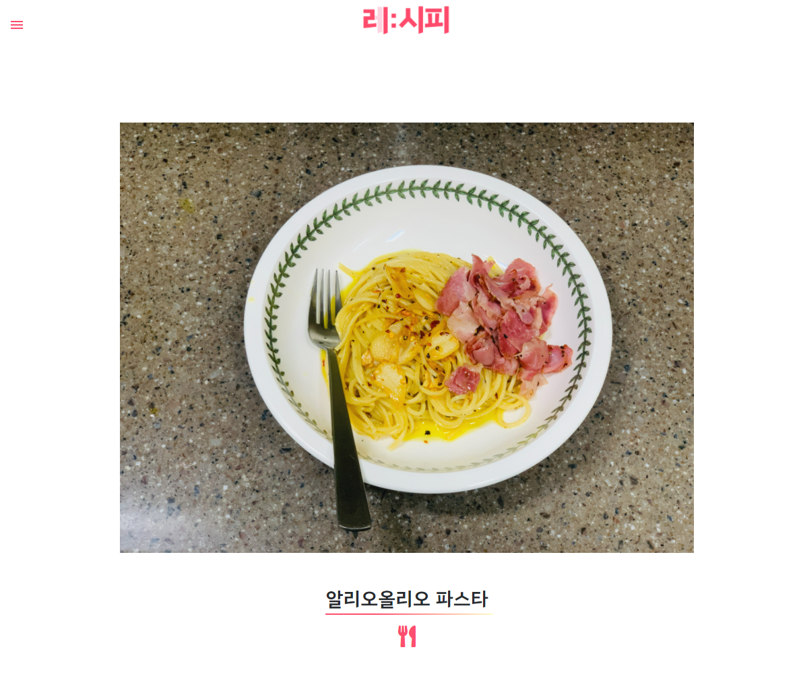

- 메인 화면1. 메뉴 추천

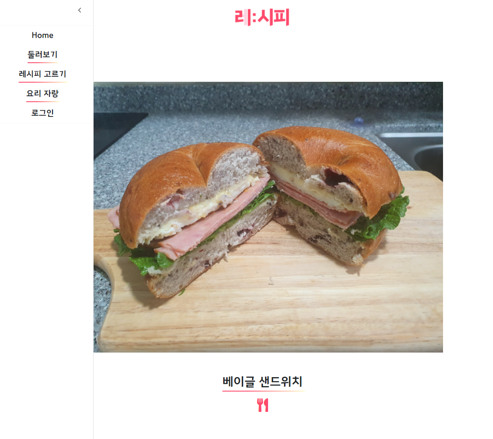

- 메인 화면 2. 사이드 메뉴

## 2. 레시피 선택

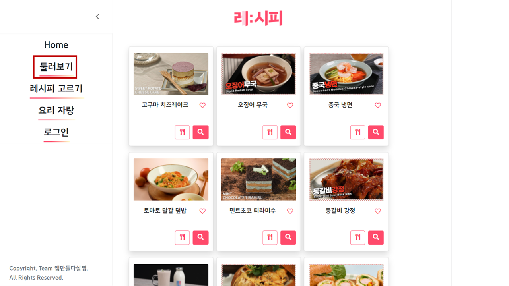

- 둘러보기 탭

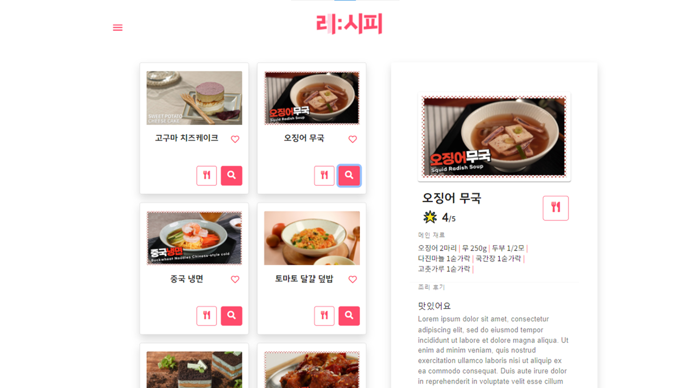

- 메뉴 선택시 사이드 설명 생성

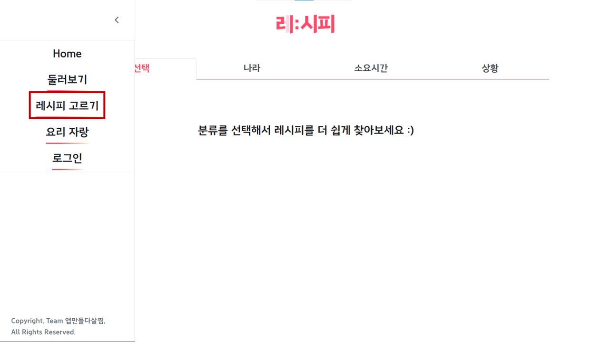

- 레시피 고르기 탭

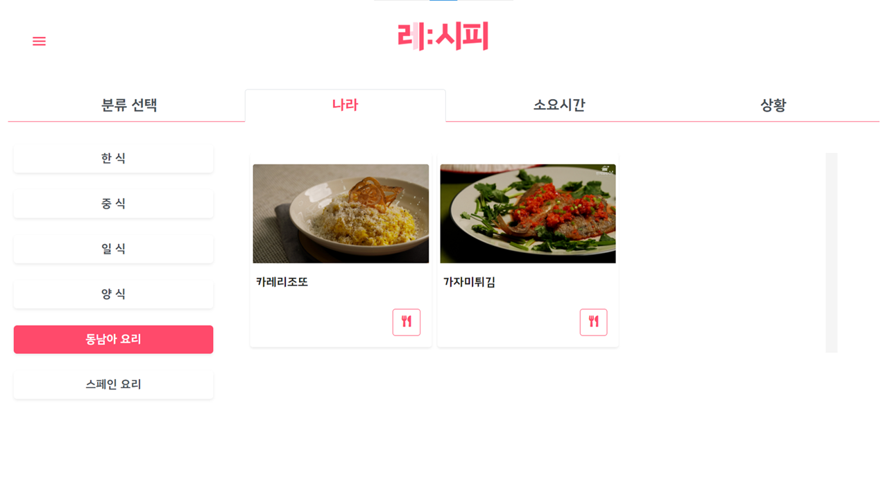

- 요리 별 분류

## 3. 레시피

음성인식(web speech api)을 사용한 기능

레시피 단계를 음성으로 조절

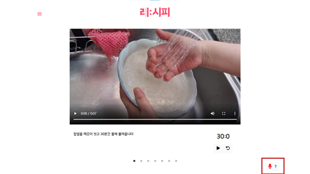

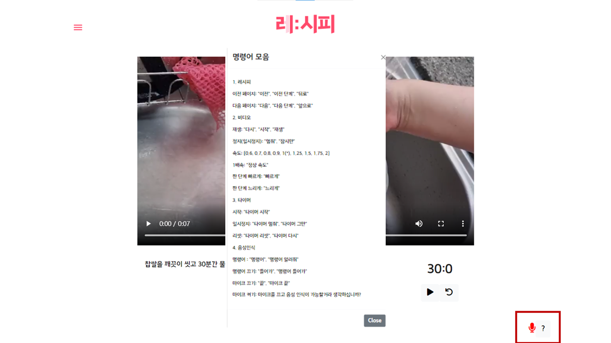

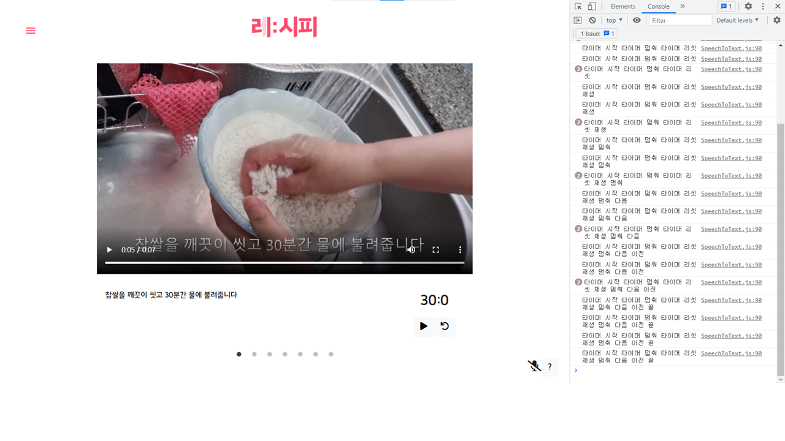

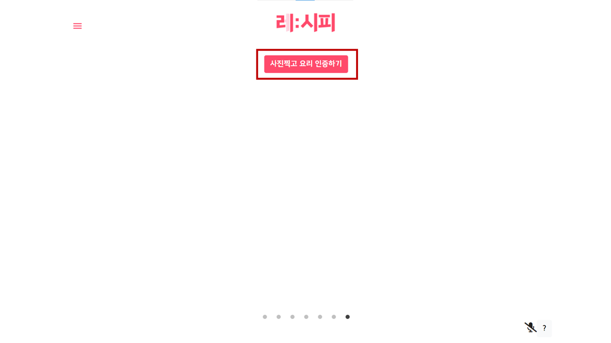

## 4. 커뮤니티

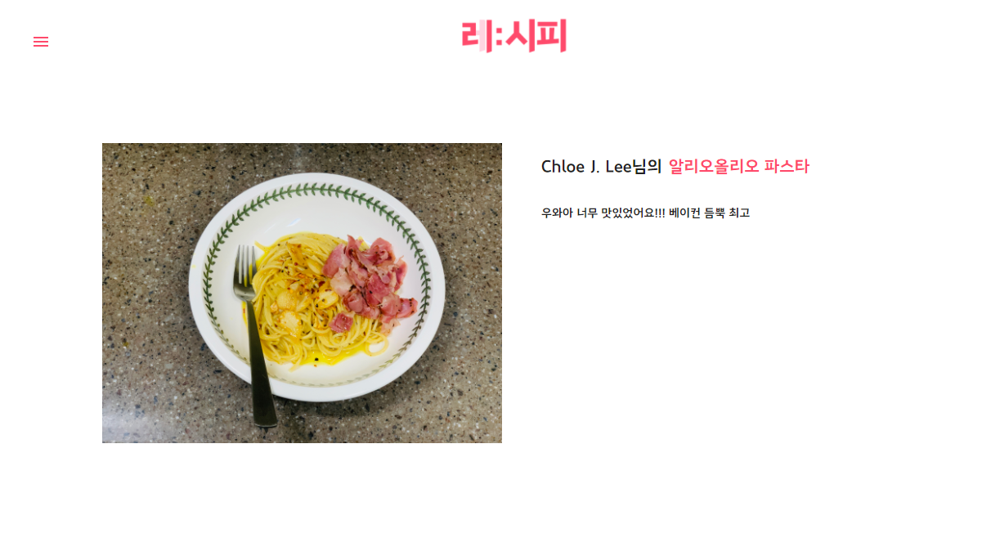

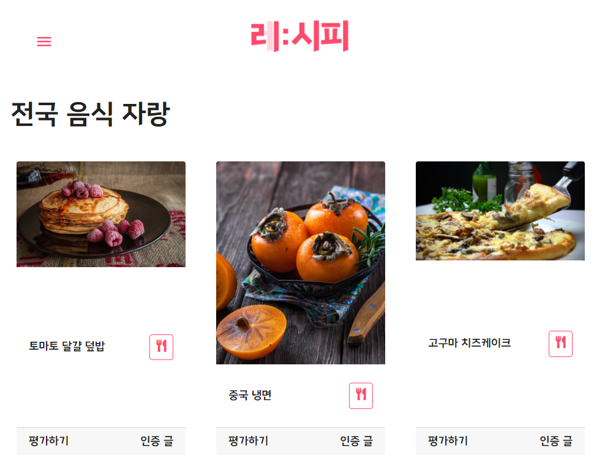

## 5. 그 외

카카오 로그인

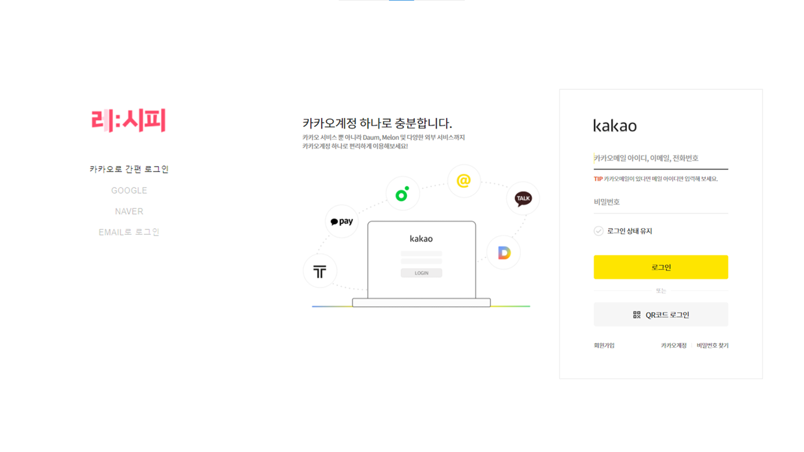
